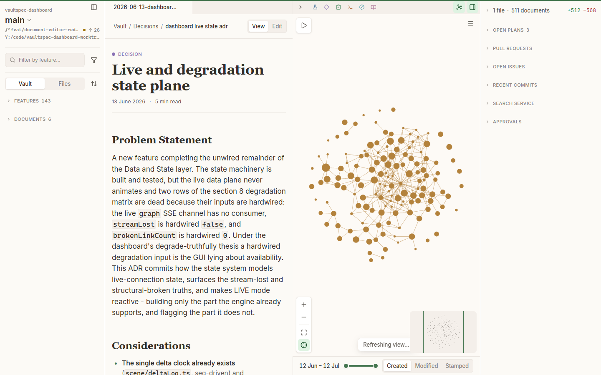
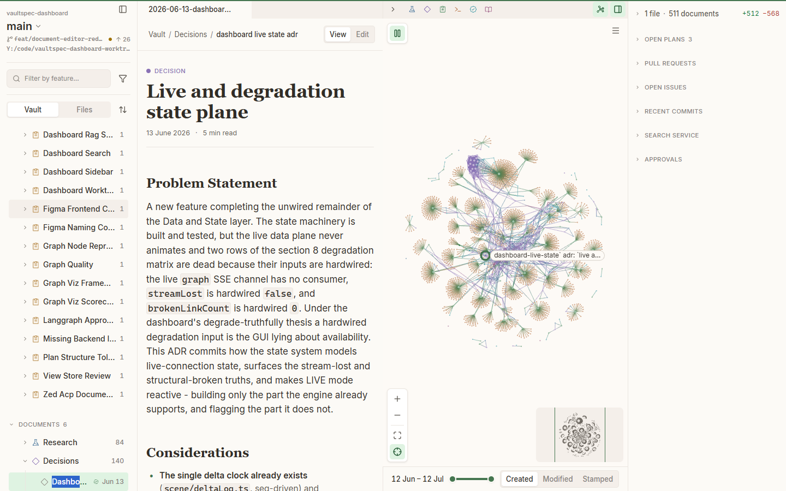
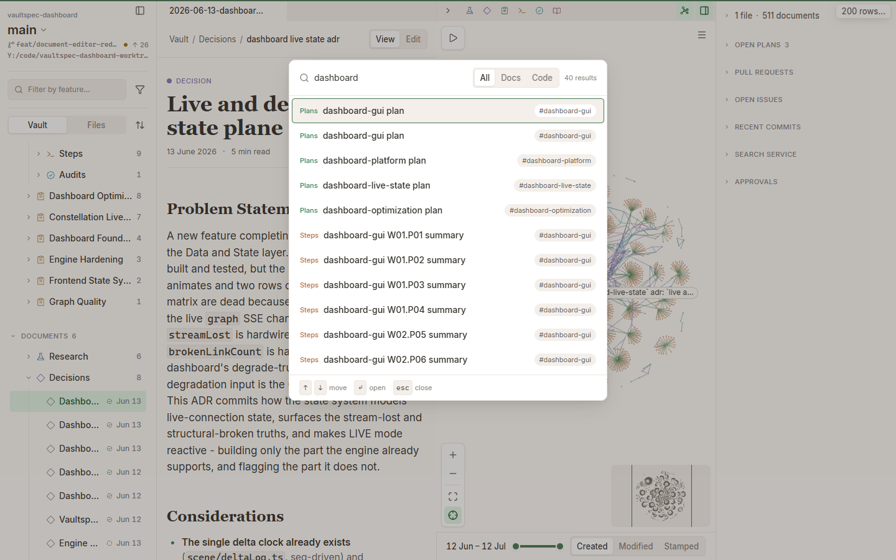
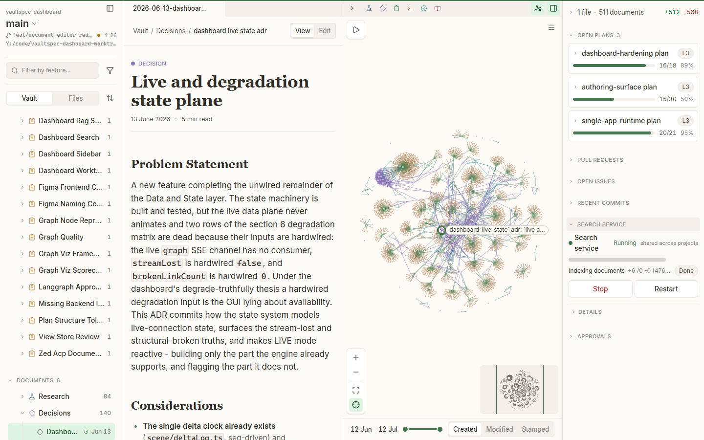
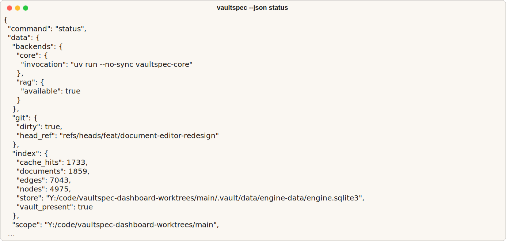

# vaultspec-dashboard

The human-facing visual workspace for a Vaultspec project.

[](https://github.com/nevenincs/vaultspec-dashboard/actions/workflows/quality-gates.yml)
[](https://github.com/nevenincs/vaultspec-dashboard/releases/latest)
[](https://github.com/nevenincs/vaultspec-dashboard/releases/latest)
[](LICENSE)

[What it does](#what-it-does) · [Project layout](#project-layout) ·
[Getting started](#getting-started) · [Capabilities](#capabilities) ·
[Vaultspec family](#vaultspec-family) · [Documentation](#documentation) ·
[Status](#status-and-license)



*The complete workspace keeps repository context, vault content, relationships, history,
and current activity in one view.*

## What it does

Project knowledge often spans source files, Git history, worktrees, current activity, and
`.vault/`. This Git-tracked directory stores research, decisions, plans, execution records,
and audits. File browsers show each item but hide the relationships between them.

vaultspec-dashboard brings this work into one visual workspace. Choose a project and
worktree, then browse documents or source files beside focused, switchable vault and code
graphs. Inspect changes, open work, and history without turning the entire project into an
unreadable graph. Search by file or title, with optional semantic search for meaning-based
discovery. Author and review Markdown without leaving the workspace.

### Visual tour



*Open a document from **Documents** > **Decisions** without losing its workspace and
graph context.*



*Search documents and code with a real query, scoped result controls, and populated results.*



*Review current open plans and search-service state from the running workspace.*

## Project layout

### Project responsibilities

| Project                                                                           | Responsibility                                                                                                                                                  |
| --------------------------------------------------------------------------------- | --------------------------------------------------------------------------------------------------------------------------------------------------------------- |
| [vaultspec-core](https://github.com/nevenincs/vaultspec-core/blob/main/README.md) | Governs the workflow and `.vault/` record. Owns validation, command-line and Model Context Protocol (MCP) surfaces, and authoritative document materialization. |
| [vaultspec-rag](https://github.com/nevenincs/vaultspec-rag/blob/main/README.md)   | Provides optional retrieval-augmented generation (RAG). Indexes vault documents and source code, then retrieves both by meaning.                                |
| **vaultspec-dashboard**                                                           | Owns the `vaultspec` binary, visual workspace, application programming interface (API), session state, and governed review experience.                          |

The dashboard delegates governed writes to core and semantic retrieval to RAG. It uses the
core command-line interface, RAG's local service API for reads, and bounded RAG commands for
explicit lifecycle actions.

### Installed runtime

The installed dashboard is one native Rust executable named `vaultspec`. It includes the
engine, API, live event stream, and web interface. Run `vaultspec serve` from a managed
worktree. The command prints a local URL for the running application.

The dashboard uses two independently installed companions:

- [vaultspec-core](https://github.com/nevenincs/vaultspec-core/blob/main/README.md) supplies
  governed vault operations. Without core, the dashboard warns and continues with those
  capabilities unavailable. Full authoring requires core 0.1.34 or later.
- [vaultspec-rag](https://github.com/nevenincs/vaultspec-rag/blob/main/docs/service-mode.md)
  supplies optional semantic search. The dashboard discovers the machine-wide service and
  can broker explicit lifecycle actions. Stopping it also affects its other clients.

A source checkout uses a separate Vite and Rust development loop; it isn't the installed
product model.



*This current-`main` status capture is generated from real `vaultspec --json status` output
against this worktree. Its lifecycle fields may be newer than the latest release.*

## Getting started

### Prerequisites and installation

vaultspec-dashboard supports macOS on Apple silicon and Intel, glibc-based Linux on arm64
and x64, and Windows on x64.

The routes below target the latest published GitHub Release. Development on `main` may
contain lifecycle changes that haven't been released yet.

Every supported channel installs the **complete product** — the `vaultspec`
dashboard, the copied external updater, the pinned A2A companion capsule, and the
signed release manifest, licenses, and software bill of materials — as one
offline-complete tree, and **verifies** that tree against its own release manifest
with the shipped bounded authority (`vaultspec verify-release`) before it is
considered installed. A partial or binary-only install is not a supported state.

**Shell script** (macOS and Linux) — the product-owned installer:

```sh
curl --proto '=https' --tlsv1.2 -LsSf https://github.com/nevenincs/vaultspec-dashboard/releases/latest/download/install.sh | sh
```

**PowerShell script** (Windows) — the product-owned installer:

```powershell
powershell -ExecutionPolicy Bypass -c "irm https://github.com/nevenincs/vaultspec-dashboard/releases/latest/download/install.ps1 | iex"
```

**MSI installer** (Windows): the complete MSI packages every product file with a
product receipt and clean uninstall; it appears as `vaultspec-<version>-x86_64-pc-windows-msvc.msi`
under [Releases](https://github.com/nevenincs/vaultspec-dashboard/releases).

**Scoop** (Windows):

```console
scoop bucket add vaultspec https://github.com/nevenincs/vaultspec-dashboard
scoop install vaultspec/vaultspec
```

The `bucket/` directory in this repository is a self-hosted Scoop bucket. Run
`scoop update vaultspec` to upgrade after a new release lands.

**WinGet** (Windows): `winget install vaultspec.vaultspec` points at the complete
MSI with manager-owned upgrade and rollback.

**Update and removal.** A self-installed copy updates itself in place with
`vaultspec update` (the copied external updater replaces the release outside the
active seat, under the installation lock — never a partial swap); package-manager
copies update through their manager (`scoop update vaultspec`, `winget upgrade`).
Uninstalling removes the product tree but **preserves your data**, which lives
outside the install directory.

> **Not supported: `cargo install` / `cargo-binstall`.** A bare Cargo install
> places only the `vaultspec` binary, not the complete offline tree, so it cannot
> preserve the release-set, receipt, verification, update, and removal guarantees
> above. `vaultspec-cli` is withheld from crates.io until a Cargo channel can carry
> the composite release contract. Use one of the channels above.

> **Note on code signing:** the installers, MSI, and binary archives are currently
> unsigned. macOS Gatekeeper will quarantine the binary on first run - right-click the
> binary, choose **Open**, and confirm the override prompt. Windows SmartScreen may show
> an "Unknown publisher" warning - click **More info** then **Run anyway** to proceed.

Confirm the installation:

```console
vaultspec --version
```

Your project must use Git. Governed capabilities also require vaultspec-core 0.1.34 or
later. Install it separately with `uv`:

```console
uv tool install 'vaultspec-core>=0.1.34'
```

From the project directory, verify that the project is ready:

```console
git rev-parse --is-inside-work-tree
vaultspec-core --version
vaultspec-core status --json -t .
```

The Git command must print `true`. The core version must be 0.1.34 or later. The status
command must exit successfully, proving that core can read the managed vault.

If the project isn't managed yet, create only the core scaffolding:

```console
vaultspec-core install core -t .
```

This command modifies the project by installing the core vault structure and configuration.
Review the
[vaultspec-core getting-started guide](https://github.com/nevenincs/vaultspec-core#getting-started)
before applying it to an existing project.

The walkthrough that follows uses an existing managed project with at least one decision
record. A freshly scaffolded project contains no records yet. Follow the
[Vaultspec framework](https://github.com/nevenincs/vaultspec-core/blob/main/docs/framework.md)
to create meaningful project records before continuing.

### Start the dashboard

From the managed Git worktree, run:

```console
vaultspec serve
```

Keep the terminal open. When the service is ready, it prints:

```text
vaultspec serve: listening on http://127.0.0.1:8767 (bearer token in service.json)
```

Open `http://127.0.0.1:8767` in your browser. A successful dashboard shows the current
worktree selector, **Vault/Files** browser, populated graph, timeline, and activity rail.
The [complete workspace capture](#what-it-does) shows this result.

### Optional semantic search

[vaultspec-rag](https://github.com/nevenincs/vaultspec-rag) adds optional semantic search.
Name matching remains available without it.

The current vaultspec-rag service runtime requires:

- CPython 3.13.x
- An NVIDIA CUDA-capable graphics processor (GPU) with about 3 GB of free video memory
- Linux or Windows

macOS, AMD GPUs, and Apple silicon aren't supported. The service has no central processing
unit (CPU) fallback. The
dashboard requires vaultspec-rag 0.2.28 or later, but it doesn't verify the resident version.

Install vaultspec-rag in the project's Python environment. A global `uv` tool installation
isn't suitable for launching its GPU service.

```console
uv add vaultspec-rag
uv run vaultspec-rag install
uv sync
uv run vaultspec-rag server start
uv run vaultspec-rag index
uv run vaultspec-rag server jobs
```

Wait for the vault and code jobs to finish before using semantic search. Follow the
[installation guide](https://github.com/nevenincs/vaultspec-rag/blob/main/docs/installation.md)
and [getting-started guide](https://github.com/nevenincs/vaultspec-rag/blob/main/docs/getting-started.md)
for the complete setup.

When the service is offline, **Search service** reports that it isn't running. Search falls
back to literal document and code-name matching and may report:

> Full search is unavailable — showing name matches only.

### Follow one record from vault to search

1. Check the **current location: _project_ / _worktree_** selector.

   **Expected result:** The selector names the project and worktree whose vault you're
   viewing. When it names the intended workspace, leave it unchanged.

1. In **Vault** mode, expand **Documents**, then expand **Decisions**.

   **Expected result:** Decision records appear beneath **Decisions**.

1. Select a decision record with a single click.

   **Expected result:** The record becomes the current selection. The graph uses the same
   selection.

1. Double-click the record, or press **Enter**, to open it in the docked reader.

   **Expected result:** The reader shows a breadcrumb, type, title, date, and body. It also
   shows **View** and **Edit** when editing is available.

1. Move focus to the graph canvas, then use the arrow keys to walk through connected nodes.

   **Expected result:** The shared selection moves through the graph. Press **Enter** to open
   the selected record, `E` to expand it, or **Escape** to clear the selection.

1. Press **Command+P** on macOS or **Ctrl+P** on Windows and Linux.

   **Expected result:** **Search documents and code** opens with **All**, **Docs**, and
   **Code** scopes.

1. Choose **Docs**, enter part of the decision title, and press **Enter** on the selected
   result.

   **Expected result:** The matching decision opens in the docked reader.

## Capabilities

See [Visual tour](#visual-tour) for the corresponding workspace, document, search, and
status views.

| User goal                         | Mounted view                                                                               | Boundary                                                                                                                                       |
| --------------------------------- | ------------------------------------------------------------------------------------------ | ---------------------------------------------------------------------------------------------------------------------------------------------- |
| Browse project content            | Project and worktree selector; **Vault** and **Files** browser                             | Shows registered projects and worktrees, the vault tree, and the code tree.                                                                    |
| Explore relationships and history | Desktop graph with timeline, filters, and minimap                                          | Switches between vault and code corpora. It doesn't mix them. The graph isn't available in compact or mobile layouts.                          |
| Inspect a document or source file | Docked Markdown viewer or read-only code viewer                                            | Code inspection includes syntax highlighting, line numbers, and copy. Code editing isn't supported.                                            |
| Edit vault content                | Markdown authoring view with **View/Edit**, toolbar, properties, rename, and save controls | Supports approved vault Markdown writes when authoring is available. Core materializes approved changes.                                       |
| Search documents and code         | `Mod+P` command palette with **All**, **Docs**, and **Code** scopes                        | Combines semantic and literal search, returns a bounded result set, and opens selections in the viewer.                                        |
| Monitor and review work           | Activity and status rail                                                                   | Covers changes, open plans, pull requests, issues, commits, search service status, approvals, and reviews. Sections can degrade independently. |

### When a capability is unavailable

The dashboard keeps unaffected features available when a data source or browser capability
fails. Each affected view reports its own limitation.

| Unavailable capability   | What the interface says                                                                                                                                                                   | What remains usable                                                                                                 |
| ------------------------ | ----------------------------------------------------------------------------------------------------------------------------------------------------------------------------------------- | ------------------------------------------------------------------------------------------------------------------- |
| vaultspec-core           | The server warns and continues. The graph may say `Links unavailable — the rest of the graph is live`.                                                                                    | Structural graph nodes, independent data, and supported reads remain. Declared links and authoring are unavailable. |
| Semantic search          | Search may say `Full search is unavailable — showing name matches only.` **Search service** says `Search service not running`.                                                            | Document-metadata and code-name matches, graph, browsing, timeline, reading, and GitHub data remain.                |
| GitHub data              | Pull-request and issue sections report that the `gh` command-line interface (CLI) isn't available or that GitHub is unavailable.                                                          | Local Git history, vault content, graph, plans, and search remain.                                                  |
| Browser graphics         | The canvas says `Graphics unavailable`. After context loss, it says `Restoring graphics…`.                                                                                                | Non-canvas views remain while the canvas recovers or graphics stay unavailable.                                     |
| Some graph relationships | The graph reports `Links unavailable — the rest of the graph is live`, `Mentions unavailable — the rest of the graph is live`, or `Timeline unavailable — the rest of the graph is live`. | The available graph stays visible without the missing relationship type.                                            |
| The entire graph         | The view says `Graph is not available`.                                                                                                                                                   | Non-graph views and any other available capabilities remain.                                                        |

### Glossary

| Term                               | Meaning                                                                                                                                                                                 |
| ---------------------------------- | --------------------------------------------------------------------------------------------------------------------------------------------------------------------------------------- |
| Vaultspec                          | A four-project family: vaultspec-core, vaultspec-rag, vaultspec-dashboard, and vaultspec-a2a.                                                                                           |
| vault or `.vault/`                 | A project directory containing structured Markdown research, decisions, plans, execution records, and audits.                                                                           |
| vault document                     | One structured Markdown artifact stored in a vault.                                                                                                                                     |
| Vaultspec pipeline                 | An approval-gated flow through Research, Decide, Plan, Execute, and Verify. See the [Vaultspec framework](https://github.com/nevenincs/vaultspec-core/blob/main/docs/framework.md).     |
| Architecture Decision Record (ADR) | A record of a binding project decision and its reasoning.                                                                                                                               |
| semantic search                    | Search that ranks indexed text by meaning, not only by exact words. See the [search and indexing guide](https://github.com/nevenincs/vaultspec-rag/blob/main/docs/search-and-index.md). |
| vaultspec-core                     | The governed workflow, command-line interface, validators, and vault-document tooling.                                                                                                  |
| vaultspec-rag                      | The optional retrieval service that indexes vault documents and code.                                                                                                                   |
| workspace                          | A registered Git project root.                                                                                                                                                          |
| worktree                           | One checked-out working copy used for the current operation.                                                                                                                            |

## Vaultspec family

| Project                                                       | Role                                                                      | Status |
| ------------------------------------------------------------- | ------------------------------------------------------------------------- | ------ |
| [vaultspec-core](https://github.com/nevenincs/vaultspec-core) | The agent harness: the pipeline, the vault, and the CLI that drives them. | Beta   |
| [vaultspec-rag](https://github.com/nevenincs/vaultspec-rag)   | The semantic search component for vault and code.                         | Beta   |
| vaultspec-dashboard                                           | The application that runs it all as a UI.                                 | Beta   |
| [vaultspec-a2a](https://github.com/nevenincs/vaultspec-a2a)   | Headless agent-to-agent orchestration.                                    | Beta   |

## Documentation

| Task                          | Documentation                                                                                                                                                                                              |
| ----------------------------- | ---------------------------------------------------------------------------------------------------------------------------------------------------------------------------------------------------------- |
| Install the dashboard         | [Download the latest release](https://github.com/nevenincs/vaultspec-dashboard/releases/latest)                                                                                                            |
| Learn the core workflow       | [Read the Vaultspec framework guide](https://github.com/nevenincs/vaultspec-core/blob/main/docs/framework.md)                                                                                              |
| Use vaultspec-core            | [Core command-line interface (CLI) reference](https://github.com/nevenincs/vaultspec-core/blob/main/docs/CLI.md) · [Core MCP reference](https://github.com/nevenincs/vaultspec-core/blob/main/docs/MCP.md) |
| Diagnose a core project       | [Run the core health doctor](https://github.com/nevenincs/vaultspec-core/blob/main/docs/CLI.md#vaultspec-core-spec-doctor)                                                                                 |
| Install vaultspec-rag         | [RAG installation guide](https://github.com/nevenincs/vaultspec-rag/blob/main/docs/installation.md)                                                                                                        |
| Search and index content      | [RAG search and indexing guide](https://github.com/nevenincs/vaultspec-rag/blob/main/docs/search-and-index.md)                                                                                             |
| Use vaultspec-rag             | [RAG CLI reference](https://github.com/nevenincs/vaultspec-rag/blob/main/docs/cli.md) · [RAG MCP reference](https://github.com/nevenincs/vaultspec-rag/blob/main/docs/mcp.md)                              |
| Troubleshoot the RAG service  | [Service-mode troubleshooting](https://github.com/nevenincs/vaultspec-rag/blob/main/docs/service-mode.md#troubleshooting)                                                                                  |
| Review dashboard changes      | [Dashboard engine release notes](engine/CHANGELOG.md)                                                                                                                                                      |
| Report an application problem | [Open a dashboard issue](https://github.com/nevenincs/vaultspec-dashboard/issues)                                                                                                                          |

## Status and license

**Status:** Beta. vaultspec-dashboard is public, unarchived, and actively developed. See
[GitHub Releases](https://github.com/nevenincs/vaultspec-dashboard/releases) for current
releases and the [changelog](engine/CHANGELOG.md) for release details.

Report bugs and request features through
[GitHub Issues](https://github.com/nevenincs/vaultspec-dashboard/issues). Include:

- Output from `vaultspec --version`
- Operating system, platform, and installation method
- Exact command and working directory
- When applicable, selected worktree or `--scope`
- Steps to reproduce the problem
- Output from `vaultspec --json status`
- A relevant error excerpt or screenshot
- vaultspec-rag health details for semantic-search issues only

Keep diagnostics focused. Redact credentials, tokens, private paths, and private content
before submitting a report.

**License:** [MIT](LICENSE).

## Contributing

These instructions apply to a source checkout. They don't install a published release.

Install the toolchain, synchronize development dependencies, and start the Vite and Rust
development servers:

```console
mise install
just dev deps sync
just dev serve
```

Run the relevant quality checks before submitting changes:

```console
just dev lint all
just dev test all
just dev test e2e
just ci
```

`just dev test all` runs the Rust and Vitest suites. End-to-end tests run separately with
`just dev test e2e`.

Build the embedded, single-binary product with:

```console
just dev build package
```

Use [`mise.toml`](mise.toml) and the [`justfile`](justfile) as the authoritative task
definitions. For design work, use:

- [Figma workflow](frontend/figma/FIGMA-WORKFLOW.md)
- [Design-system contract](frontend/figma/DESIGN-SYSTEM.md)
- [Figma workspace guide](frontend/figma/README.md)
- [Token guide](frontend/tokens/README.md)

Read the [current-main application lifecycle](docs/application-runtime.md) when working on
unreleased launch, update, or single-instance behavior.

Release automation lives in the
[Release Please workflow](.github/workflows/release-please.yml) and
[distribution workflow](.github/workflows/release.yml). Use conventional commits and let
Release Please update the [engine changelog](engine/CHANGELOG.md).

Regenerate terminal README assets with:

```console
uv run --no-sync python scripts/render_readme_assets.py
```

To regenerate application captures, keep `just dev serve` running in one terminal. Run the
capture task in another:

```console
npm --prefix frontend run readme:capture
```

The capture task generates the README figures and their manifest.
