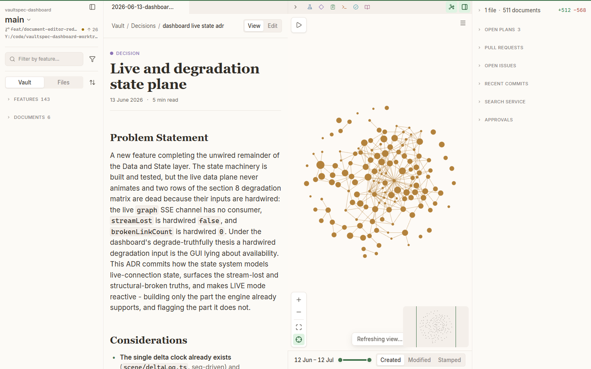
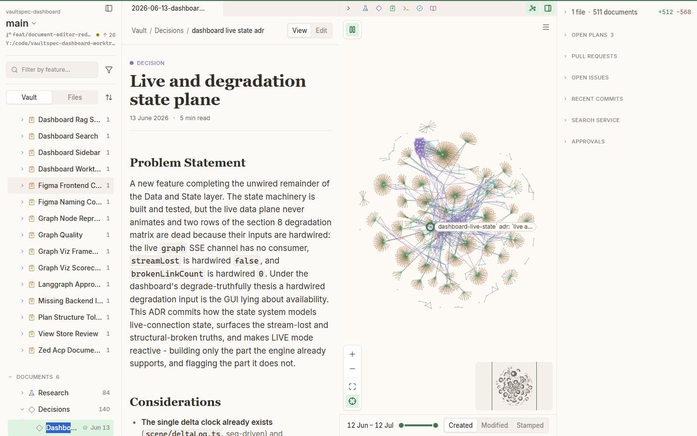
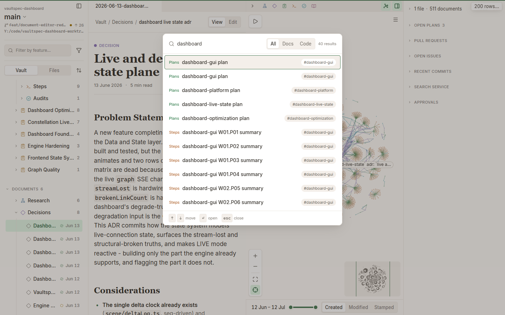
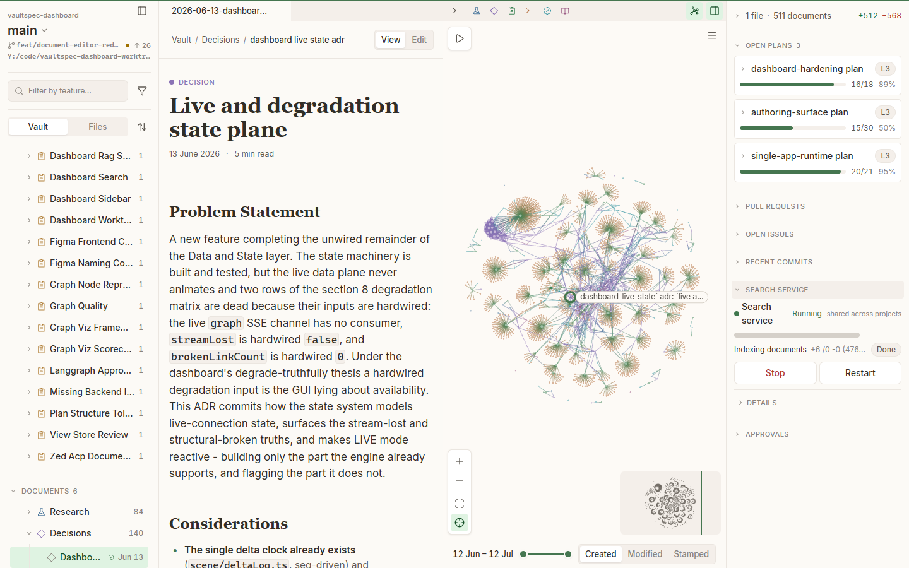

# vaultspec-dashboard

The human-facing visual workspace for a Vaultspec project.

Browse feature records, source files, and Git history in a local web interface.
Choose a project and worktree, follow relationships in the graph, and read or edit
vault Markdown alongside your code.

[](https://github.com/nevenincs/vaultspec-dashboard/actions/workflows/quality-gates.yml)
[](https://github.com/nevenincs/vaultspec-dashboard/releases/latest)
[](https://github.com/nevenincs/vaultspec-dashboard/releases/latest)
[](LICENSE)

[Visual tour](#visual-tour) ·
[Getting started](#getting-started) · [Capabilities](#capabilities) ·
[Vaultspec family](#vaultspec-family) · [Documentation](#documentation) ·
[Status](#status-and-license)



## Visual tour



*Open a document from **Documents** > **Decisions** without losing its workspace and
graph context.*



*Search documents and code with a real query, scoped result controls, and populated results.*



*Review current open plans and search-service state from the running workspace.*

<p id="project-layout"></p>
<p id="project-responsibilities"></p>
<p id="installed-runtime"></p>

## Getting started

### Prerequisites and installation

Supported platforms:

- macOS on Apple silicon
- Linux on arm64, glibc 2.28 or newer
- Linux on x64, glibc 2.28 or newer
- Windows on x64

Intel Macs aren't supported. Use Bash on macOS and Linux, or PowerShell 5.1 or
newer on Windows.

The installers download the [latest release](https://github.com/nevenincs/vaultspec-dashboard/releases/latest),
check the archive's SHA-256 checksum, and run `vaultspec verify-release` on the
installed files.

On macOS or Linux:

```bash
curl -fsSL https://github.com/nevenincs/vaultspec-dashboard/releases/latest/download/install.sh | bash
```

On Windows:

```powershell
& ([scriptblock]::Create((irm https://github.com/nevenincs/vaultspec-dashboard/releases/latest/download/install.ps1)))
```

The scripts don't change `PATH`. To run `vaultspec` by name in the current
terminal, add its binary directory.

On macOS or Linux:

```bash
export PATH="$HOME/.local/share/vaultspec/bin:$PATH"
```

On Windows:

```powershell
Set-Item Env:Path "$env:LOCALAPPDATA\Programs\vaultspec\bin;$env:Path"
```

Repeat this step in each new terminal. Confirm the installation:

```console
vaultspec --version
```

`cargo install` and `cargo binstall` aren't supported: they don't install all
required runtime files.

Release binaries are unsigned. Your operating system may warn before running them.

Agent-to-agent orchestration isn't available in v0.1.12.

### Updating

In v0.1.12, `vaultspec update` doesn't download a newer release. The installers
also refuse to overwrite an existing installation. These commands don't provide
an in-place upgrade. Consult the target version's
[release notes](https://github.com/nevenincs/vaultspec-dashboard/releases)
for upgrade instructions.

<p id="removing-it-and-what-stays"></p>

### Uninstall

The installation commands don't save the scripts. Download
[install.sh](https://github.com/nevenincs/vaultspec-dashboard/releases/latest/download/install.sh)
or [install.ps1](https://github.com/nevenincs/vaultspec-dashboard/releases/latest/download/install.ps1),
then run the saved script from its directory.

On macOS or Linux:

```bash
bash ./install.sh --uninstall
```

On Windows:

```powershell
.\install.ps1 -Uninstall
```

For a custom installation, pass its directory with `--install-dir` or
`-InstallDir`. If removal is refused, the script leaves the installation in place.
The script doesn't delete your project files or per-user application data.

### Prepare a project

Use a Git repository. Vault validation and authoring require vaultspec-core 0.1.34
or later, installed separately:

```console
uv tool install 'vaultspec-core>=0.1.34'
```

From the repository root, create the vault structure if the project does not already
use Vaultspec:

```console
vaultspec-core install core
```

This writes the vault structure and project policy. For coding-agent setup too, follow
the [core installation guide](https://github.com/nevenincs/vaultspec-core#install).
Inspect the project's records with:

```console
vaultspec-core status
```

A new vault has no records. [Start a feature](https://github.com/nevenincs/vaultspec-core#start-a-feature)
to create some, or open an existing project's vault for the walkthrough below.

### Start the dashboard

From the managed Git worktree, run:

```console
vaultspec serve
```

Keep the terminal open. When the service is ready, it prints:

```text
vaultspec serve: listening on http://127.0.0.1:8767 (bearer token in service.json)
```

Open `http://127.0.0.1:8767` in your browser. A successful dashboard shows the current
worktree selector, **Vault/Files** browser, populated graph, timeline, and activity rail.
The [complete workspace capture](#vaultspec-dashboard) shows this result.

### Optional semantic search

Install [vaultspec-rag](https://github.com/nevenincs/vaultspec-rag#install), then
[start its service and index your repository](https://github.com/nevenincs/vaultspec-rag#use-it).
The RAG guide lists the supported GPUs, Python versions, and installation routes.

The dashboard connects to the machine-wide RAG service. Wait for indexing to finish
before searching by meaning. Stopping that service also affects its other clients.

Without RAG, search still matches document titles and file names. Browsing, the graph,
and Git history remain available.

### Follow one record from vault to search

1. Select your project and worktree in the location selector.
1. Expand **Vault > Documents > Decisions** and select a record. The graph highlights
   the same selection.
1. Double-click the record, or press **Enter**, to open its title, properties, and
   Markdown body in the reader. **Edit** appears when authoring is available.
1. Open **Search documents and code** with **Command+Option+S** on macOS or
   **Ctrl+Alt+S** on Windows and Linux. These are the default bindings; use your
   configured shortcut if you changed them.
1. Choose **Docs**, enter part of the record's title, and press **Enter** on a result
   to open it.

## Capabilities

See [Visual tour](#visual-tour) for the corresponding workspace, document, search, and
status views.

| User goal                         | Mounted view                                                                               | Boundary                                                                                                                                       |
| --------------------------------- | ------------------------------------------------------------------------------------------ | ---------------------------------------------------------------------------------------------------------------------------------------------- |
| Browse project content            | Project and worktree selector; **Vault** and **Files** browser                             | Shows registered projects and worktrees, the vault tree, and the code tree.                                                                    |
| Explore relationships and history | Desktop graph with timeline, filters, and minimap                                          | Switches between vault and code corpora. It doesn't mix them. The graph isn't available in compact or mobile layouts.                          |
| Inspect a document or source file | Docked Markdown viewer or read-only code viewer                                            | Code inspection includes syntax highlighting, line numbers, and copy. Code editing isn't supported.                                            |
| Edit vault content                | Markdown authoring view with **View/Edit**, toolbar, properties, rename, and save controls | Supports approved vault Markdown writes when authoring is available. Core materializes approved changes.                                       |
| Search documents and code         | Search dialog with **All**, **Docs**, and **Code** scopes                                  | Combines semantic and literal search, returns a bounded result set, and opens selections in the viewer.                                        |
| Monitor and review work           | Activity and status rail                                                                   | Covers changes, open plans, pull requests, issues, commits, search service status, approvals, and reviews. Sections can degrade independently. |

### When a capability is unavailable

The dashboard keeps unaffected features available when a data source or browser capability
fails. Each affected view reports its own limitation.

| Unavailable capability   | What the interface says                                                                                                                                                                   | What remains usable                                                                                                 |
| ------------------------ | ----------------------------------------------------------------------------------------------------------------------------------------------------------------------------------------- | ------------------------------------------------------------------------------------------------------------------- |
| vaultspec-core           | The server warns and continues. The graph may say `Links unavailable — the rest of the graph is live`.                                                                                    | Structural graph nodes, independent data, and supported reads remain. Declared links and authoring are unavailable. |
| Semantic search          | Search may say `Full search is unavailable — showing name matches only.` **Search service** says `Search service not running`.                                                            | Document-metadata and code-name matches, graph, browsing, timeline, reading, and GitHub data remain.                |
| GitHub data              | Pull-request and issue sections report that the `gh` command-line interface (CLI) isn't available or that GitHub is unavailable.                                                          | Local Git history, vault content, graph, plans, and search remain.                                                  |
| Browser graphics         | The canvas says `Graphics unavailable`. After context loss, it says `Restoring graphics…`.                                                                                                | Non-canvas views remain while the canvas recovers or graphics stay unavailable.                                     |
| Some graph relationships | The graph reports `Links unavailable — the rest of the graph is live`, `Mentions unavailable — the rest of the graph is live`, or `Timeline unavailable — the rest of the graph is live`. | The available graph stays visible without the missing relationship type.                                            |
| The entire graph         | The view says `Graph is not available`.                                                                                                                                                   | Non-graph views and any other available capabilities remain.                                                        |

### Glossary

| Term                               | Meaning                                                                                                                                                                                 |
| ---------------------------------- | --------------------------------------------------------------------------------------------------------------------------------------------------------------------------------------- |
| Vaultspec                          | A four-project family: vaultspec-core, vaultspec-rag, vaultspec-dashboard, and vaultspec-a2a.                                                                                           |
| vault or `.vault/`                 | A project directory containing structured Markdown research, decisions, plans, execution records, and audits.                                                                           |
| vault document                     | One structured Markdown artifact stored in a vault.                                                                                                                                     |
| Vaultspec pipeline                 | An approval-gated flow through Research, Decide, Plan, Execute, and Verify. See the [Vaultspec framework](https://github.com/nevenincs/vaultspec-core/blob/main/docs/framework.md).     |
| Architecture Decision Record (ADR) | A record of a binding project decision and its reasoning.                                                                                                                               |
| semantic search                    | Search that ranks indexed text by meaning, not only by exact words. See the [search and indexing guide](https://github.com/nevenincs/vaultspec-rag/blob/main/docs/search-and-index.md). |
| vaultspec-core                     | The governed workflow, command-line interface, validators, and vault-document tooling.                                                                                                  |
| vaultspec-rag                      | The optional retrieval service that indexes vault documents and code.                                                                                                                   |
| workspace                          | A registered Git project root.                                                                                                                                                          |
| worktree                           | One checked-out working copy used for the current operation.                                                                                                                            |

## Vaultspec family

| Project                                                       | Role                                                       | Status |
| ------------------------------------------------------------- | ---------------------------------------------------------- | ------ |
| [vaultspec-core](https://github.com/nevenincs/vaultspec-core) | Decision-driven harness for coding agents, and humans.     | Beta   |
| [vaultspec-rag](https://github.com/nevenincs/vaultspec-rag)   | The semantic search component for vault and code.          | Beta   |
| vaultspec-dashboard                                           | The human-facing visual workspace for a Vaultspec project. | Beta   |
| [vaultspec-a2a](https://github.com/nevenincs/vaultspec-a2a)   | Headless agent-to-agent orchestration.                     | Beta   |

## Documentation

| Task                          | Documentation                                                                                                                                                                                              |
| ----------------------------- | ---------------------------------------------------------------------------------------------------------------------------------------------------------------------------------------------------------- |
| Install the dashboard         | [Download the latest release](https://github.com/nevenincs/vaultspec-dashboard/releases/latest)                                                                                                            |
| Learn the core workflow       | [Read the Vaultspec framework guide](https://github.com/nevenincs/vaultspec-core/blob/main/docs/framework.md)                                                                                              |
| Use vaultspec-core            | [Core command-line interface (CLI) reference](https://github.com/nevenincs/vaultspec-core/blob/main/docs/CLI.md) · [Core MCP reference](https://github.com/nevenincs/vaultspec-core/blob/main/docs/MCP.md) |
| Diagnose a core project       | [Run the core health doctor](https://github.com/nevenincs/vaultspec-core/blob/main/docs/CLI.md#vaultspec-core-spec-doctor)                                                                                 |
| Install vaultspec-rag         | [RAG installation guide](https://github.com/nevenincs/vaultspec-rag/blob/main/docs/installation.md)                                                                                                        |
| Search and index content      | [RAG search and indexing guide](https://github.com/nevenincs/vaultspec-rag/blob/main/docs/search-and-index.md)                                                                                             |
| Use vaultspec-rag             | [RAG CLI reference](https://github.com/nevenincs/vaultspec-rag/blob/main/docs/cli.md) · [RAG MCP reference](https://github.com/nevenincs/vaultspec-rag/blob/main/docs/mcp.md)                              |
| Troubleshoot the RAG service  | [Service-mode troubleshooting](https://github.com/nevenincs/vaultspec-rag/blob/main/docs/service-mode.md#troubleshooting)                                                                                  |
| Review dashboard changes      | [Dashboard engine release notes](engine/CHANGELOG.md)                                                                                                                                                      |
| Report an application problem | [Open a dashboard issue](https://github.com/nevenincs/vaultspec-dashboard/issues)                                                                                                                          |

## Status and license

**Status:** Beta. vaultspec-dashboard is public, unarchived, and actively developed. See
[GitHub Releases](https://github.com/nevenincs/vaultspec-dashboard/releases) for current
releases and the [changelog](engine/CHANGELOG.md) for release details.

Report bugs and request features through
[GitHub Issues](https://github.com/nevenincs/vaultspec-dashboard/issues). Include:

- Output from `vaultspec --version`
- Operating system, platform, and installation method
- Exact command and working directory
- When applicable, selected worktree or `--scope`
- Steps to reproduce the problem
- Output from `vaultspec --json status`
- A relevant error excerpt or screenshot
- vaultspec-rag health details for semantic-search issues only

Keep diagnostics focused. Redact credentials, tokens, private paths, and private content
before submitting a report.

**License:** [MIT](LICENSE).

## Contributing

These instructions apply to a source checkout. They don't install a published release.

Install the toolchain, synchronize development dependencies, and start the Vite and Rust
development servers:

```console
mise install
just deps sync
just serve
```

Run the relevant quality checks before submitting changes:

```console
just lint all
just test all
just test e2e
just ci
```

`just test all` runs the Rust and Vitest suites. End-to-end tests run separately with
`just test e2e`.

Build the embedded, single-binary product with:

```console
just build package
```

Use [`mise.toml`](mise.toml) and the [`justfile`](justfile) as the authoritative task
definitions. For design work, use:

- [Figma workflow](frontend/figma/FIGMA-WORKFLOW.md)
- [Design-system contract](frontend/figma/DESIGN-SYSTEM.md)
- [Figma workspace guide](frontend/figma/README.md)
- [Token guide](frontend/tokens/README.md)

Read the [current-main application lifecycle](docs/application-runtime.md) when working on
unreleased launch, update, or single-instance behavior.

Release automation lives in the
[Release Please workflow](.github/workflows/release-please.yml) and
[distribution workflow](.github/workflows/release.yml). Use conventional commits and let
Release Please update the [engine changelog](engine/CHANGELOG.md).

Regenerate terminal README assets with:

```console
just docs readme-assets
```

To regenerate application captures, keep `just serve` running in one terminal. Run the
capture task in another:

```console
npm --prefix frontend run readme:capture
```

The capture task generates the README figures and their manifest.
